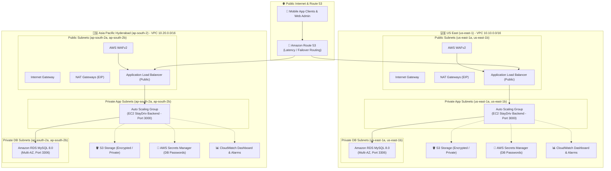

# 🚀 StayDriv Production Multi-Region Infrastructure (Terraform)

This repository contains a modular, production-ready Infrastructure as Code (IaC) implementation for **StayDriv** across two AWS regions:
1. **US East (N. Virginia)**: `us-east-1` (VPC CIDR: `10.10.0.0/16`)
2. **Asia Pacific (Hyderabad)**: `ap-south-2` (VPC CIDR: `10.20.0.0/16`)

---

## 🏛️ Architecture Overview



---

## 🌐 Network Allocation & Subnets

### 1. US East (`us-east-1`) — VPC CIDR: `10.10.0.0/16`
| Subnet Name | AZ | CIDR Block | Route Table Target | Purpose |
| :--- | :--- | :--- | :--- | :--- |
| `public-subnet-1` | `us-east-1a` | `10.10.1.0/24` | Internet Gateway | ALB, NAT Gateway |
| `public-subnet-2` | `us-east-1b` | `10.10.2.0/24` | Internet Gateway | ALB, NAT Gateway |
| `private-app-subnet-1` | `us-east-1a` | `10.10.11.0/24` | NAT Gateway | EC2 Backend Nodes |
| `private-app-subnet-2` | `us-east-1b` | `10.10.12.0/24` | NAT Gateway | EC2 Backend Nodes |
| `private-db-subnet-1` | `us-east-1a` | `10.10.21.0/24` | Isolated (Local) | RDS MySQL Primary |
| `private-db-subnet-2` | `us-east-1b` | `10.10.22.0/24` | Isolated (Local) | RDS MySQL Standby |

### 2. Hyderabad (`ap-south-2`) — VPC CIDR: `10.20.0.0/16`
| Subnet Name | AZ | CIDR Block | Route Table Target | Purpose |
| :--- | :--- | :--- | :--- | :--- |
| `public-subnet-1` | `ap-south-2a` | `10.20.1.0/24` | Internet Gateway | ALB, NAT Gateway |
| `public-subnet-2` | `ap-south-2b` | `10.20.2.0/24` | Internet Gateway | ALB, NAT Gateway |
| `private-app-subnet-1` | `ap-south-2a` | `10.20.11.0/24` | NAT Gateway | EC2 Backend Nodes |
| `private-app-subnet-2` | `ap-south-2b` | `10.20.12.0/24` | NAT Gateway | EC2 Backend Nodes |
| `private-db-subnet-1` | `ap-south-2a` | `10.20.21.0/24` | Isolated (Local) | RDS MySQL Primary |
| `private-db-subnet-2` | `ap-south-2b` | `10.20.22.0/24` | Isolated (Local) | RDS MySQL Standby |

---

## 🔒 Security & Defense-in-Depth

1. **Security Group Chaining**:
   - **ALB Security Group**: Accepts HTTP (`80`) and HTTPS (`443`) from `0.0.0.0/0`. Forwards traffic to EC2 servers on port `3000`.
   - **EC2 Security Group**: Inbound port `3000` is restricted **strictly** to the ALB Security Group ID. No direct internet ingress.
   - **RDS Security Group**: Inbound port `3306` is restricted **strictly** to the EC2 Security Group ID. Zero internet ingress. `publicly_accessible = false`.

2. **Network ACLs (NACLs)**:
   - Dedicated NACLs per tier (Public, Application Private, Database Private).
   - Database NACL allows inbound traffic on port 3306 and egress return traffic **only** to the private application CIDR ranges.

3. **Perimeter WAFv2**:
   - Web ACL directly attached to the ALB.
   - Includes **AWSManagedRulesCommonRuleSet** (OWASP Top 10).
   - Includes **AWSManagedRulesKnownBadInputsRuleSet** (Exploit payloads).
   - Includes **AWSManagedRulesSQLiRuleSet** (SQL Injection prevention).
   - Includes **Rate-Based Limiting** (2,000 requests per 5 minutes per IP).

4. **Zero-Trust, Account Lock & Access Governance**:
   - Target AWS Account: **`347234956877`** (`staydriv`). Provider enforces `allowed_account_ids = ["347234956877"]`.
   - **1 Team Lead User** (`staydriv-teamlead`): Operational administration of StayDriv infrastructure, monitoring, and Secrets Manager.
   - **10 Client Users** (`staydriv-client-01` to `staydriv-client-10`): Least-privilege scoped access to client application assets in S3 and CloudWatch status metrics (zero access to private subnets, EC2, or RDS).
   - EC2 instances use **AWS Systems Manager (SSM) Session Manager** for secure shell access without opening SSH port 22.
   - Database master passwords are cryptographically generated (`random_password`) and securely stored in **AWS Secrets Manager**.
   - IMDSv2 is enforced on all EC2 launch templates (`http_tokens = "required"`).

---

## 📁 Repository Structure

```text
terraform/
├── modules/
│   ├── vpc/                    # VPC, 6 Subnets, IGW, NAT Gateways, Route Tables
│   ├── nacl/                   # Tiered NACLs (Public, App, DB)
│   ├── security_groups/        # Chained Security Groups (ALB -> EC2 -> RDS)
│   ├── iam/                    # EC2 Role with SSM, Secrets Manager, CloudWatch, S3
│   ├── iam_access/             # IAM Users for 1 Team Lead + 10 Clients & Credentials
│   ├── alb_waf/                # Public ALB, Target Group, HTTPS, AWS WAFv2
│   ├── asg/                    # Launch Template (IMDSv2, UserData) & Auto Scaling Group
│   ├── rds_mysql/              # Amazon RDS MySQL (Multi-AZ, Secrets Manager)
│   ├── s3/                     # Encrypted S3 Bucket with Public Access Block & Versioning
│   ├── route53/                # ACM Certificate & Route 53 Latency Routing
│   └── cloudwatch/             # Log Groups, Metric Alarms (CPU, 5XX, Latency), Dashboard
├── environments/
│   ├── us-east-1/              # Production US East (N. Virginia)
│   │   ├── providers.tf
│   │   ├── variables.tf
│   │   ├── terraform.tfvars
│   │   ├── main.tf
│   │   └── outputs.tf
│   └── ap-south-2/             # Production Asia Pacific (Hyderabad)
│       ├── providers.tf
│       ├── variables.tf
│       ├── terraform.tfvars
│       ├── main.tf
│       └── outputs.tf
└── README.md
```

---

## ⚙️ Configuration Variables

| Variable | Description | US East Default | Hyderabad Default |
| :--- | :--- | :--- | :--- |
| `project_name` | Name prefix for resources | `staydriv` | `staydriv` |
| `environment` | Environment identifier | `prod` | `prod` |
| `aws_region` | AWS region | `us-east-1` | `ap-south-2` |
| `vpc_cidr` | VPC CIDR block | `10.10.0.0/16` | `10.20.0.0/16` |
| `availability_zones` | List of 2 AZs | `["us-east-1a", "us-east-1b"]` | `["ap-south-2a", "ap-south-2b"]` |
| `public_subnet_cidrs` | Public subnets | `["10.10.1.0/24", "10.10.2.0/24"]` | `["10.20.1.0/24", "10.20.2.0/24"]` |
| `private_app_subnet_cidrs` | Private App subnets | `["10.10.11.0/24", "10.10.12.0/24"]` | `["10.20.11.0/24", "10.20.12.0/24"]` |
| `private_db_subnet_cidrs` | Private DB subnets | `["10.10.21.0/24", "10.10.22.0/24"]` | `["10.20.21.0/24", "10.20.22.0/24"]` |
| `single_nat_gateway` | 1 NAT GW vs 1 per AZ | `false` (Full HA) | `false` (Full HA) |
| `instance_type` | EC2 instance size | `t3.small` | `t3.small` |
| `desired_capacity` | Initial EC2 instance count | `2` | `2` |
| `minimum_capacity` | Minimum EC2 instance count | `2` | `2` |
| `maximum_capacity` | Max EC2 instance autoscaling | `6` | `6` |
| `app_port` | Application backend port | `3000` | `3000` |
| `db_instance_class` | RDS database instance size | `db.t4g.small` | `db.t4g.small` |
| `multi_az` | RDS Multi-AZ standby replica | `true` | `true` |

---

## 🛠️ Step-by-Step Deployment Guide

### Prerequisites
1. **AWS CLI** configured (`aws configure`).
2. **Terraform CLI** installed (v1.5.0 or newer).
3. **AWS Hyderabad (`ap-south-2`) Opt-in**:
   > [!NOTE]
   > `ap-south-2` is an opt-in region. If you haven't enabled it yet, go to:
   > **AWS Console** $\to$ **Account** $\to$ **AWS Regions** $\to$ **Enable ap-south-2**.

---

### Step 1: Deploy US East (`us-east-1`)

```bash
cd terraform/environments/us-east-1

# Initialize Terraform modules and providers
terraform init

# Review the infrastructure plan
terraform plan

# Apply the configuration (Do this only when ready to provision)
terraform apply
```

---

### Step 2: Deploy Hyderabad (`ap-south-2`)

```bash
cd terraform/environments/ap-south-2

# Initialize Terraform modules and providers
terraform init

# Review the infrastructure plan
terraform plan

# Apply the configuration (Do this only when ready to provision)
terraform apply
```

---

### Step 3: Enabling Custom Domain & HTTPS (ACM + Route 53)

When you have a registered domain (e.g., `staydriv.com`) hosted in Route 53:

1. Open `terraform/environments/us-east-1/terraform.tfvars`:
   ```hcl
   enable_route53_and_acm = true
   domain_name            = "staydriv.com"
   subdomain              = "us-api"
   hosted_zone_id         = "Z0123456789EXAMPLE"
   ```
2. Open `terraform/environments/ap-south-2/terraform.tfvars`:
   ```hcl
   enable_route53_and_acm = true
   domain_name            = "staydriv.com"
   subdomain              = "hyd-api"
   hosted_zone_id         = "Z0123456789EXAMPLE"
   ```
3. Run `terraform apply` in each environment. Terraform will automatically:
   - Request an ACM SSL certificate.
   - Create DNS validation records in Route 53.
   - Wait for certificate validation.
   - Attach the HTTPS (443) listener to the ALB.
   - Configure Route 53 Latency-Based Routing records so users in India/Asia connect to Hyderabad, and users in the Americas connect to US East!

---

## 📤 Outputs Available After Deployment

Each environment outputs all required connection strings and infrastructure IDs:
```bash
terraform output
```

- `vpc_id`
- `public_subnet_ids`
- `private_app_subnet_ids`
- `private_db_subnet_ids`
- `alb_dns_name`
- `rds_endpoint`
- `rds_secrets_manager_arn`
- `s3_bucket_name`
- `security_group_ids` (`alb`, `ec2`, `rds`)
- `asg_name`
- `cloudwatch_dashboard`
